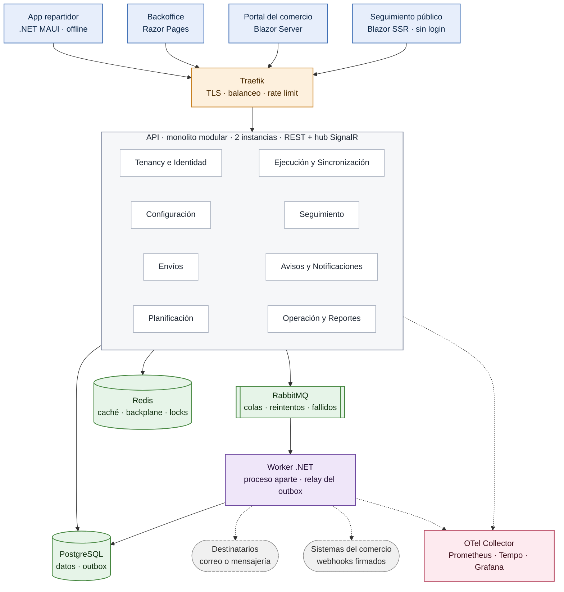

# Arquitectura lógica

Una sola API autoriza; el Worker trabaja solo desde la cola.

## Leyenda

| Elemento | Significado |
| :---- | :---- |
| Rectángulo | Aplicación desplegable o módulo de negocio |
| Cilindro | Almacenamiento |
| Rectángulo doble | Broker de mensajes |
| Estadio punteado | Sistema externo a la plataforma |
| Flecha llena | Llamada directa |
| Flecha punteada | Salida asíncrona o telemetría |

## Regla de dependencias

`Domain ← Application ← Infrastructure`. Domain no referencia ningún proyecto; Application
depende solo de Domain y declara las interfaces que Infrastructure implementa. La API y el
Worker registran dependencias e invocan Handlers. Verificado con NetArchTest en el pipeline.

## Comunicación entre módulos

Dentro del proceso, síncrona por las interfaces públicas de cada módulo: hacia afuera un
módulo solo expone Commands, Queries y DTOs, nunca sus entidades ni sus repositorios.

Todo efecto hacia afuera se escribe como evento de integración en la tabla outbox, en la
misma transacción que el cambio, y se publica a RabbitMQ.
